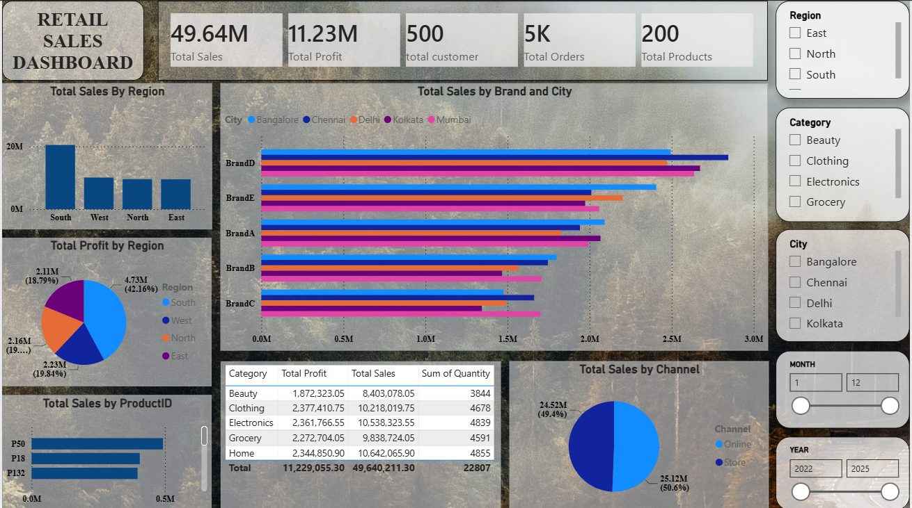

<div align="center">

# 🛍️ Retail Store Multi-Year Sales & Profitability Dashboard

### An interactive Power BI dashboard uncovering 4 years of retail sales & profitability insights


**5,000 transactions&nbsp;•&nbsp;4 years (2022–2025)&nbsp;•&nbsp;5 stores&nbsp;•&nbsp;5 cities&nbsp;•&nbsp;500+ customers&nbsp;•&nbsp;200 products**

</div>

<p align="center">
  
</p>

  
<p align="center"><em></em></p>

---

## 📑 Table of Contents

- [Project Aim](#-project-aim)
- [Business Questions Answered](#-business-questions-answered)
- [Repository Structure](#️-repository-structure)
- [Tools & Tech Stack](#-tools--tech-stack)
- [Data Model](#-data-model)
- [Report Pages](#-report-pages)
- [How to Use](#-how-to-use)
- [Author](#-author)

---

## 🎯 Project Aim

> To design and develop an interactive multi-page Power BI dashboard that analyzes multi-year retail sales performance across products, customers, stores, and regions — enabling stakeholders to track revenue and profitability trends, identify top/bottom performing products, stores, and customers, and support data-driven decisions using DAX-based KPIs, time-intelligence measures, and dynamic slicers.

---

## 📌 Business Questions Answered

<table>
<tr><td valign="top" width="50%">

**🟦 Page 1 — Overview**
1. What are the overall Sales, Profit, Orders, Customers, and Product counts?
2. Which brands sell the most, and in which cities?
3. How is revenue split across sales channels (Online vs Store)?
4. Which individual products drive the most sales?
5. How do Sales, Profit, and Quantity compare across categories?
6. Which region contributes the most to sales and profit?

</td><td valign="top" width="50%">

**🟩 Page 2 — Sales Trend & Profitability**
1. How have Sales/Profit trended YoY (this year vs. last)?
2. Which stores generate the highest sales and profit?
3. Who are the top customers by revenue?
4. How do monthly Sales and Profit trends move together?
5. How does MTD profit compare against the previous month?
6. Which salespeople generate the most orders and revenue?

</td></tr>
</table>

---

## 🗂️ Repository Structure

```
Retail-Store-Multiyear-PowerBI-Project/
│
├── 📄 README.md                 → Project overview (this file)
├── 📄 DOCUMENTATION.md          → Full data cleaning, modeling & DAX documentation
│
├── 📂 data/
│   └── Retail_Sales_MultiYear_raw.csv     → Raw source dataset (5,000 transactions)
│
├── 📂 powerbi/
│   └── Retail_Store_Multiyear.pbix        → Final Power BI project file
│
└── 📂 images/
    ├── Page1_Overview.png                              → Dashboard screenshot (add yours!)
    └── Page2_Sales_Trend_and_Profitability_Analysis.png → Dashboard screenshot
```

> 📸 **To-do:** Add a screenshot of the **Overview** page to `images/` as `Page1_Overview.png` — export it from Power BI Desktop via *File → Export → Export to PDF*, or a plain screenshot.

---

## 🧰 Tools & Tech Stack

<div align="center">

| 🛠️ Tool | Role |
|:---:|---|
| **Excel** | Raw data source |
| **Power Query (M)** | Data cleaning, transformation, star-schema modeling |
| **Power BI Desktop** | Data modeling (DAX), report design, visualization |
| **DAX** | 35+ measures including time-intelligence (YTD, MTD, QTD, PY) |

</div>

---

## 🧱 Data Model

A clean **star schema** — one fact table surrounded by four dimension tables:

```
                     ┌────────────────┐
                     │  Dim Customer  │
                     └───────┬────────┘
                             │
  ┌────────────────┐   ┌────┴────────┐   ┌────────────────┐
  │  Dim Product    ├───┤ Fact Sales  ├───┤   Dim Store    │
  └────────────────┘   └────┬────────┘   └────────────────┘
                             │
                     ┌───────┴────────┐
                     │  Dim Calender  │
                     └────────────────┘
```

<div align="center">

| Table | Type | Grain | Rows |
|:---:|:---:|---|:---:|
| **Fact Sales** | Fact | 1 row per order line | 5,000 |
| Dim Product | Dimension | 1 row per product | 200 |
| Dim Customer | Dimension | 1 row per customer | 500 |
| Dim Store | Dimension | 1 row per Store × Salesperson | 300 |
| Dim Calender | Dimension *(calculated)* | 1 row per calendar day | 2022–2025 |

</div>

📘 See **[DOCUMENTATION.md](DOCUMENTATION.md)** for full column-level detail, cleaning steps, relationships, and the complete DAX measure catalog.

---

## 📊 Report Pages

<div align="center">

| # | Page Name | Purpose |
|:---:|---|---|
| 1️⃣ | **Overview** | Snapshot of overall KPIs and categorical breakdowns (Brand, City, Channel, Region, Category) |
| 2️⃣ | **Sales Trend & Profitability Analysis** | Time-based trends, store/salesperson performance, and top-customer analysis |

</div>

---

## 🚀 How to Use

1. **Clone or download** this repository.
2. Open `powerbi/Retail_Store_Multiyear.pbix` in **Power BI Desktop** (or Power BI Service).
3. If prompted, update the data source path to point to the raw CSV in `data/`, or re-import via Power Query.
4. Use the slicers — **Year, Quarter, Month, Region, City, Category, Brand, Store, Channel** — to explore the data interactively.

```bash
git clone https://github.com/<your-username>/Retail-Store-Multiyear-PowerBI-Project.git
```

---

## 👤 Author

Built as a self-driven Power BI portfolio project to practice **data modeling, DAX time intelligence, and dashboard storytelling.**

<div align="center">

⭐ If you found this project useful, consider giving it a star!

</div>
